<p align="center" width="100%">
  
</p>

# pyvenv-manager

A GTK4-based, Python-powered desktop application for creating, managing, and organizing Python virtual environments (venvs) from a graphical interface — and binding Python projects/apps directly to them.

## The Problem

Almost anyone who works with Python eventually runs into the same mess: a separate `venv` gets created for every new project, these environments end up scattered across each project's own folder, it becomes hard to remember which environment belongs to which project, and duplicate libraries pile up unnecessarily across disk. Manually repeating `python3 -m venv`, `source .../bin/activate`, and `pip install -r requirements.txt` for every project wastes time and is error-prone — especially for users who are used to GUIs or switch between projects often.

Another frustrating part of this workflow shows up when running a project cloned from GitHub or a script you wrote yourself: which Python interpreter and which dependencies that file will use is usually configured by hand. Running `./script.py` or `python3 script.py` most of the time just calls the system's default Python; to make it use the correct environment, you either have to open a terminal and activate the environment yourself, or explicitly call the script with the right interpreter path every single time.

## The Solution

pyvenv-manager turns this scattered setup into something manageable from a single, central place. Through the app, you can create as many Python environments as you need, manage each one from the GUI (installing/removing packages, listing/inspecting installed packages), and — most importantly — **bind** Python project files or installed applications (including Python-based apps that have a `.desktop` entry) to one of these environments. Once a project is bound to an environment, running it normally — e.g. `./project.py` or `python3 project.py` — automatically runs it through the interpreter of the environment it's bound to, in the background. The user never has to manually create a venv, activate it, or remember the correct interpreter path.

So instead of creating separate, scattered environments for every single project, you can run different projects and applications that need particular sets of libraries through a small number of well-organized, centrally managed environments.

## What Makes It Different

Many existing tools only bring the "create a venv, install packages into it" workflow into a GUI. What sets pyvenv-manager apart is its ability to create a **persistent binding between environments and project/application files**:

- You can bind a Python script (your own project or one cloned from GitHub) to an environment through the GUI.
- You can bind an installed Python-based application that has a `.desktop` file the same way.
- Once bound, no matter how that file or app is launched (`./project.py`, `python3 project.py`, an app shortcut, etc.), the interpreter of the environment it's bound to is used automatically.
- This means you no longer have to manually track "which project was using which venv?" — the binding information is stored by the app and applied automatically.

## Features

- **Environment creation / deletion**: Create or remove as many Python environments as you want from the GUI.
- **Setup via requirements.txt**: When creating a new environment, select your project's `requirements.txt` file and its dependencies get installed automatically as soon as the environment is created.
- **Package management**: After an environment is created, install new packages, remove existing ones, and view information (such as version) about installed packages, all from the GUI.
- **Project/application binding**: Bind a Python file or a `.desktop`-registered application to an environment via the relevant option; however that file is launched afterward, it runs through the bound environment's interpreter.
- **Per-environment terminal**: Click the terminal button next to any environment to open a terminal with that environment already active, for any manual work you need to do.
- **Centralized management**: All environments are listed and managed from a single interface, removing the need to create a separate, scattered venv per project.

## Who It's For

- Developers who constantly switch between multiple Python projects/scripts
- Users who'd rather manage environments and dependencies through a GUI than wrestle with terminal commands

## Tech Stack

- **UI**: GTK4
- **Language**: Python

### **Dependencies**

```bash
libgtk-4-dev
gir1.2-gtk-4.0
python3-gi
python3-venv
```

Clone the repository
```bash
git clone https://github.com/heyderismayilli092/pyvenv-manager ~/pyvenv-manager
```

Run application
```bash
python3 ~/pyvenv-manager/src/main.py
```

### Build .deb package
```bash
sudo apt install devscripts git-buildpackage
sudo mk-build-deps -ir
gbp buildpackage --git-export-dir=/tmp/build/pyvenv-manager -us -uc
```

### Preview Video


### **Screenshots**

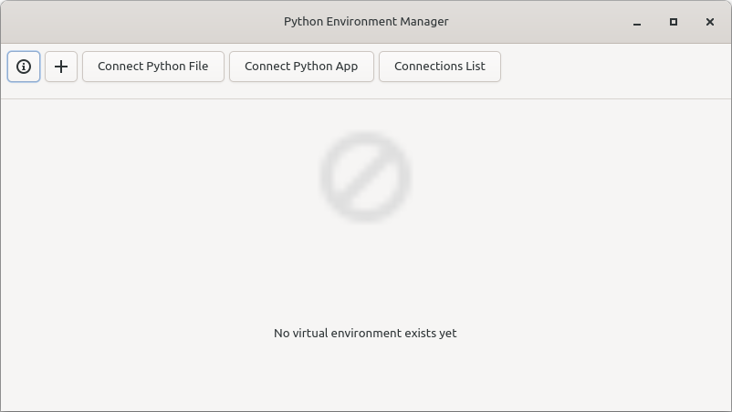
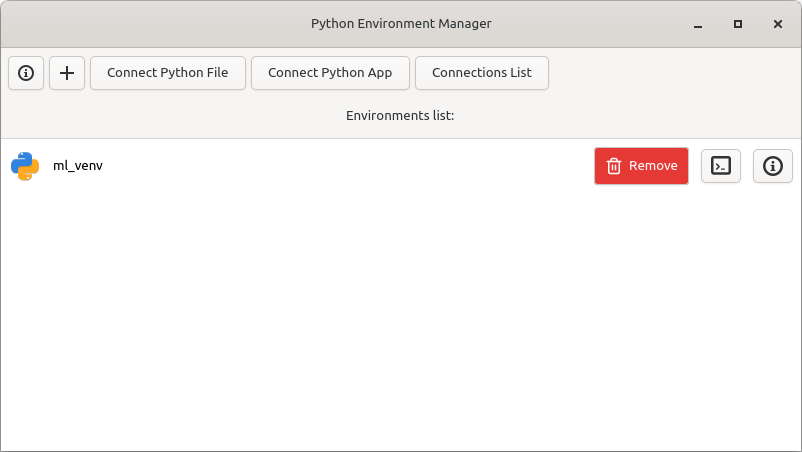
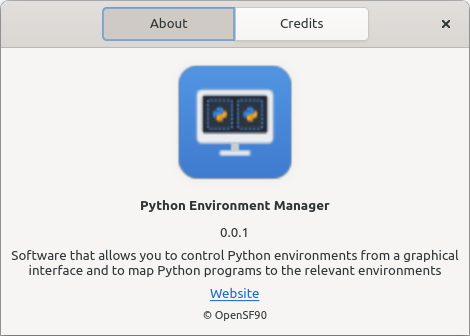
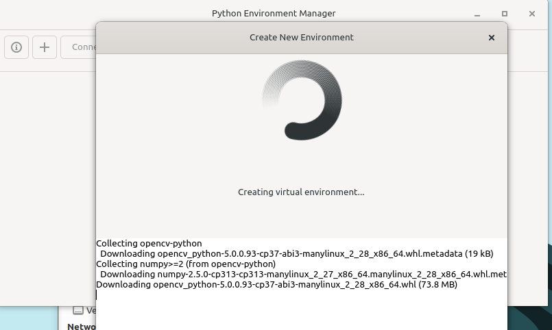
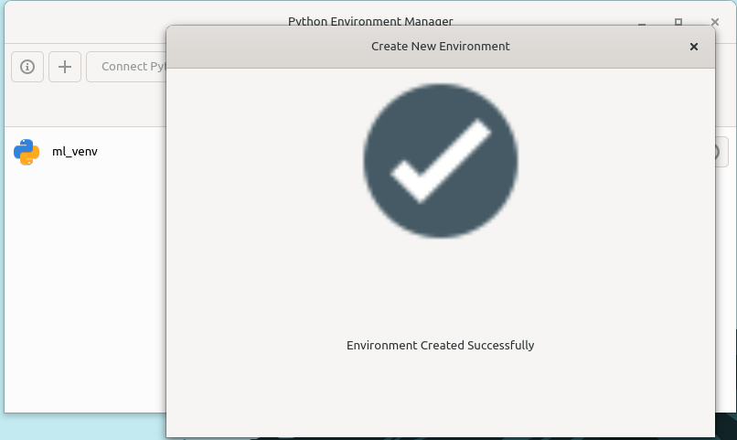
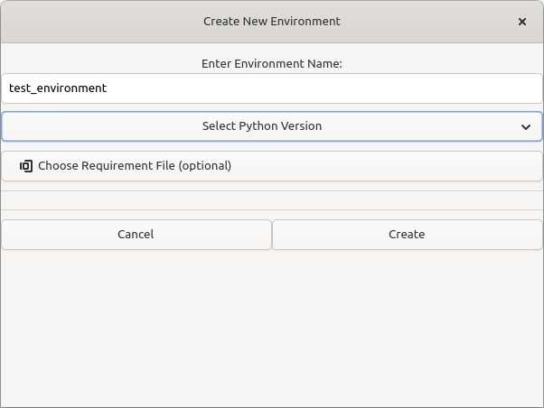
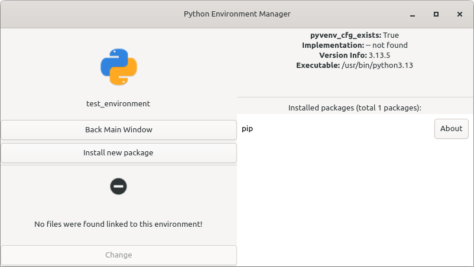
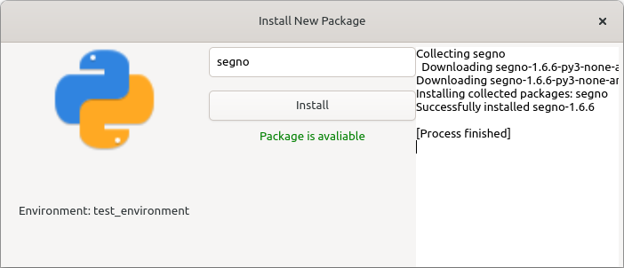
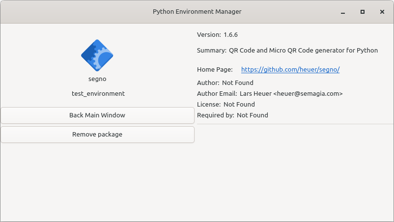
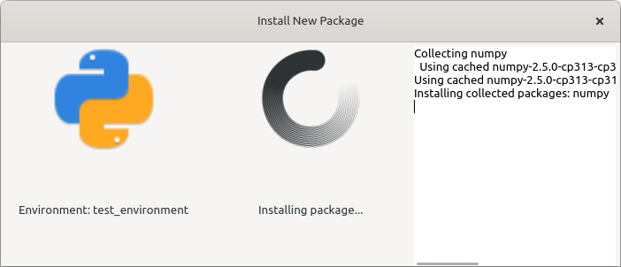
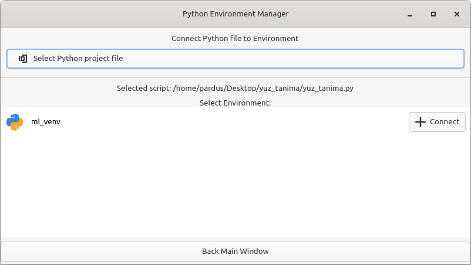
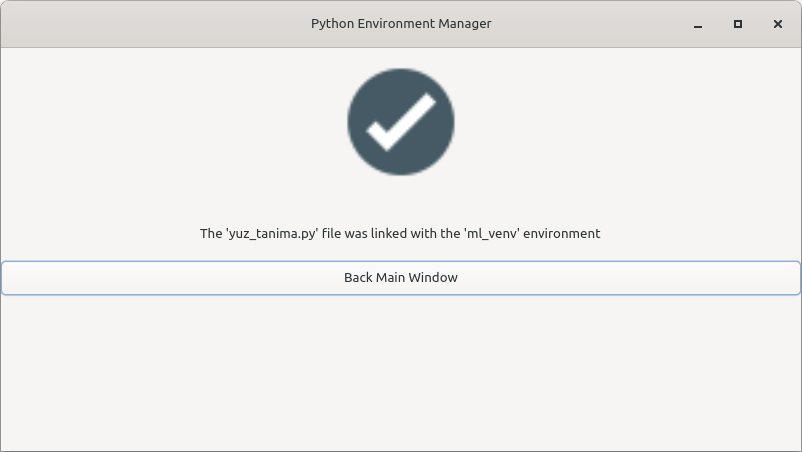
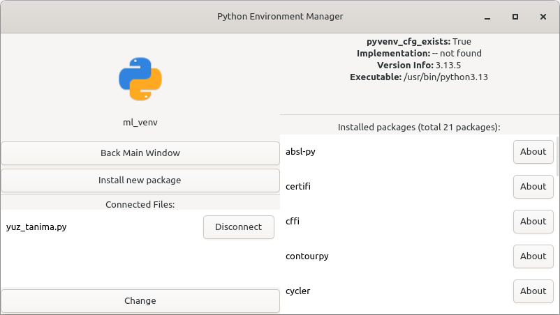
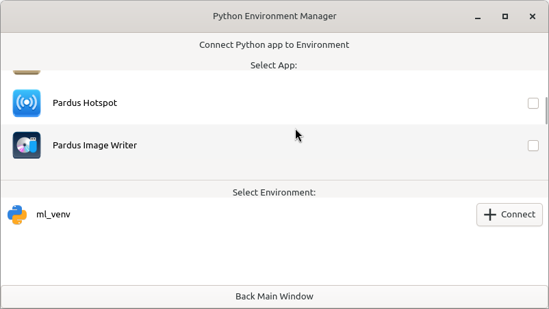

